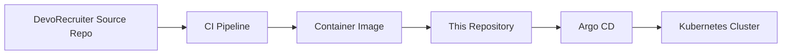

# DevoRecruiter GitOps

This repository defines the desired Kubernetes state for DevoRecruiter.

It is intentionally separate from the application source monorepo so deployment changes can be reviewed, promoted, and rolled out independently from application code.

## Architecture



## Scope

This repository should contain:

- Helm charts
- environment values
- Argo CD project definitions
- Argo CD application definitions
- exact Docker image SHA references

This repository must not contain:

- application source code
- Dockerfiles
- CI build logic
- cloud credentials
- Kubernetes Secret values
- kubeconfig files
- Terraform state
- local runtime data

## Repository Layout

- `charts/` reusable or application charts
- `environments/` environment-specific values and overlays
- `argocd/` Argo CD project and application definitions

## Deployment Flow

1. The application repository builds and tests the software.
2. The image is published with an immutable tag.
3. This repository is updated with the new tag or release reference.
4. Argo CD reconciles the cluster state to match Git.

## Branching and Commits

- Use branches such as `feat/<area>`, `fix/<area>`, `docs/<area>`, or `gitops/<area>`
- Keep commit messages short and descriptive
- Prefer Conventional Commits such as `chore(gitops): update image reference`
- Avoid mixing infrastructure policy changes with unrelated app changes

## Contributing

- Update only the deployment state you intend to change
- Keep secrets outside Git
- Document rollout risk when a manifest change may affect availability

## Repository Layout

```text
argocd/
  applications/
  projects/
charts/
  api-back/
  api-bff/
  frontend/
environments/
  dev/
```

## Helm Charts

The current Phase 5 charts are:

- `charts/frontend`: Angular frontend served by nginx on port 80.
- `charts/api-bff`: NestJS BFF API served on port 3000.
- `charts/api-back`: FastAPI RAG service served on port 8000.

Each chart renders a Deployment, Service, ConfigMap, and disabled-by-default Ingress. The FastAPI chart also includes an optional PersistentVolumeClaim for Chroma data.

## Secret Handling

Secrets are intentionally not stored in this repository. Charts reference externally-created Kubernetes Secrets such as:

- `devorecruiter-api-bff-secrets`
- `devorecruiter-api-back-secrets`

Those Secrets should be created later through a secure process such as Sealed Secrets, External Secrets Operator, Azure Key Vault integration, or manual cluster bootstrap for local development.

## Current Phase

Phase 5 is repository and Helm basics only.

No Kubernetes deployment is performed in this phase.
No Azure resource is created in this phase.
No Argo CD installation is performed in this phase.
